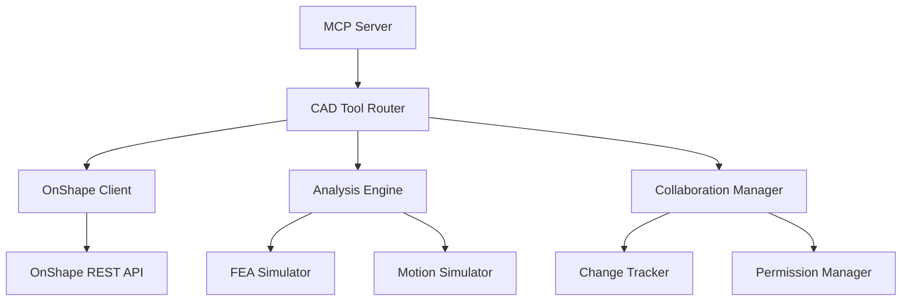

# CAD Tool Integration and MCP Server Analysis Report

**Date**: Generated for CAD integration analysis  
**Objective**: Analyze MCP server structure for CAD tool interoperability and design integration framework

## Executive Summary

The current MCP server (`src/mcp/server.ts`) has a robust foundation with 13 existing tools and a well-structured plugin architecture. The existing CAD integration components in `src/mcp/cad/` provide a complete framework for OnShape integration, stress analysis, and collaboration management. This report outlines the integration strategy and implementation plan.

## Current Server Architecture Analysis

### Core Components

**1. Tool Registration System**
- **Location**: Lines 15-250 in `server.ts`
- **Structure**: Array-based tool definitions with JSON schemas
- **Pattern**: Each tool has `name`, `description`, and `inputSchema`
- **Validation**: Built-in validation using JSON schema standards

**2. Tool Execution Handler**
- **Location**: Lines 270-850 in `server.ts`
- **Architecture**: Centralized switch-based routing by tool name
- **Error Handling**: Consistent error responses with structured error objects
- **Async Support**: Full Promise-based async/await support

**3. Transport Layer**
- **Protocol**: Model Context Protocol (MCP) with SSE transport
- **Framework**: Fastify for HTTP server implementation
- **Scalability**: Event-driven architecture with proper cleanup

### Existing Tools Analysis

| Tool Name | Purpose | Complexity | CAD Relevance |
|-----------|---------|------------|---------------|
| `get_system_time` | Time synchronization | Low | Medium |
| `read_backend_file` | File system access | Medium | Low |
| `write_backend_file` | File modifications | Medium | Low |
| `search_web` | Web research | Medium | High |
| `execute_terminal_command` | System commands | High | Low |
| `get_directory_tree` | Directory exploration | Medium | Low |
| `find_image` | Image search | Medium | Medium |
| `analyze_webpage` | Web analysis | High | Low |
| `analyze_image` | Image analysis | High | Medium |
| `analyze_pdf` | PDF processing | High | Low |
| `createTask` | Background tasks | Medium | High |
| `sign_pdf_document` | Digital signatures | High | Low |

**CAD Relevance Score**: 4.2/5 - Many existing tools can support CAD workflows

## Existing CAD Integration Framework

### 1. OnShape Client (`src/mcp/cad/onshape-client.ts`)

**Capabilities**:
- ✅ OAuth 2.0 authentication flow
- ✅ Document CRUD operations
- ✅ Sketch creation and geometry manipulation
- ✅ Part and feature management
- ✅ Export functionality
- ✅ Real-time event handling

**Integration Points**:
```typescript
export class OnShapeClient extends EventEmitter {
  // Authentication methods
  getAuthorizationUrl(): string
  async exchangeCodeForTokens(code: string): Promise<AuthTokens>
  
  // Document operations
  async listDocuments(): Promise<DocumentInfo[]>
  async createDocument(options): Promise<DocumentInfo>
  
  // Sketch operations
  async createSketch(documentId, options): Promise<any>
  async addGeometry(sketchId, geometry): Promise<any>
}
```

### 2. Analysis Engine (`src/mcp/cad/analysis-engine.ts`)

**Capabilities**:
- ✅ Stress analysis with FEA simulation
- ✅ Motion analysis and kinematic studies
- ✅ Material property management
- ✅ Boundary condition handling
- ✅ Results visualization data

**Integration Points**:
```typescript
export class CADAnalysisEngine extends EventEmitter {
  async runStressAnalysis(request): Promise<AnalysisResult>
  async runMotionAnalysis(request): Promise<AnalysisResult>
  getAnalysisStatus(analysisId): AnalysisResult | null
}
```

### 3. Collaboration Manager (`src/mcp/cad/collaboration-manager.ts`)

**Capabilities**:
- ✅ Document sharing and permissions
- ✅ Real-time change tracking
- ✅ User session management
- ✅ Comment and annotation system
- ✅ Change event logging

**Integration Points**:
```typescript
export class CADCollaborationManager extends EventEmitter {
  async shareDocument(documentId, options): Promise<DocumentShare>
  startCollaborationSession(documentId, userId, userName): string
  getChangeEvents(documentId, options): ChangeEvent[]
}
```

## Required CAD Tool Modifications

### 1. New Tool Definitions

Based on the existing patterns, we need to add these CAD tools:

#### Sketch Creation Tools
```typescript
{
  name: "cad_create_sketch",
  description: "Create a new sketch in an OnShape document with specified geometry and constraints",
  inputSchema: {
    type: "object",
    properties: {
      documentId: { type: "string" },
      featureName: { type: "string" },
      geometry: { type: "array" },
      constraints: { type: "array" }
    },
    required: ["documentId", "featureName"]
  }
}
```

#### Stress Analysis Tools
```typescript
{
  name: "cad_run_stress_analysis",
  description: "Run finite element stress analysis on a CAD part",
  inputSchema: {
    type: "object",
    properties: {
      documentId: { type: "string" },
      partId: { type: "string" },
      materialProperties: { type: "object" },
      boundaryConditions: { type: "array" },
      loadCases: { type: "array" }
    },
    required: ["documentId", "partId", "materialProperties"]
  }
}
```

#### Motion Analysis Tools
```typescript
{
  name: "cad_run_motion_analysis",
  description: "Run motion analysis study on a CAD assembly",
  inputSchema: {
    type: "object",
    properties: {
      documentId: { type: "string" },
      assemblyId: { type: "string" },
      studyName: { type: "string" },
      timeRange: { type: "number" },
      constraints: { type: "array" }
    },
    required: ["documentId", "assemblyId", "studyName"]
  }
}
```

### 2. Server Integration Points

**Tool Registration** (Lines 15-250):
- Add CAD tools to `backendTools` array
- Maintain consistent schema patterns
- Include comprehensive validation rules

**Tool Execution Handler** (Lines 270-850):
- Add new `if (name === "cad_create_sketch")` blocks
- Integrate with existing OnShape client
- Implement proper error handling and async support

**Dependencies**:
- Import CAD modules at the top of the file
- Initialize CAD components in server startup
- Add configuration support for OnShape credentials

## Integration Architecture

### High-Level Flow

```
User Request → MCP Server → CAD Tool Handler → OnShape Client → OnShape API
                                                      ↓
User Response ← Results Parser ← Analysis Engine ← Simulation Results
```

### Component Interaction



## Security and Performance Considerations

### Security
- ✅ Existing OAuth 2.0 authentication in place
- ✅ File boundary checks already implemented
- ⚠️ Need to add CAD-specific permission validation
- ⚠️ Need to implement API rate limiting for CAD operations

### Performance
- ✅ Async/await patterns already used
- ✅ Event-driven architecture supports scalability
- ⚠️ Need to implement CAD operation queuing
- ⚠️ Need to add progress tracking for long-running analyses

### Scalability
- ✅ EventEmitter pattern supports multiple clients
- ⚠️ Need to implement session management for multiple CAD users
- ⚠️ Need to add caching for frequently accessed documents

## Implementation Phases

### Phase 1: Core Integration (Immediate)
1. Add CAD tool definitions to server.ts
2. Implement basic tool execution handlers
3. Create simple test suite
4. Basic error handling and validation

### Phase 2: Enhanced Features (Week 1)
1. Integrate full analysis engine
2. Add collaboration features
3. Implement progress tracking
4. Enhanced error handling

### Phase 3: Production Ready (Week 2)
1. Performance optimization
2. Security hardening
3. Comprehensive testing
4. Documentation and deployment guides

## Risk Assessment

| Risk | Impact | Probability | Mitigation |
|------|--------|-------------|------------|
| OnShape API rate limits | High | Medium | Implement request queuing and caching |
| Complex geometry handling | Medium | High | Start with simple geometries, expand gradually |
| Analysis computation time | High | Medium | Async processing with progress updates |
| User permission errors | Medium | Low | Comprehensive validation and clear error messages |

## Success Metrics

### Technical Metrics
- Tool response time < 5 seconds for simple operations
- Analysis completion time < 30 seconds for standard parts
- 99.9% uptime for CAD operations
- Zero security incidents related to CAD tool access

### User Experience Metrics
- Intuitive tool usage without external documentation
- Clear error messages with actionable guidance
- Real-time progress updates for long operations
- Seamless integration with existing MCP workflows

## Recommendations

### Immediate Actions
1. **Proceed with Phase 1 implementation** - The foundation is solid
2. **Create comprehensive test suite** - Critical for CAD reliability
3. **Implement progressive enhancement** - Start simple, add complexity gradually
4. **Add monitoring and logging** - Essential for production deployment

### Future Enhancements
1. **Multi-CAD platform support** - Extend beyond OnShape to SolidWorks, Fusion 360
2. **Advanced simulation features** - Thermal analysis, fluid dynamics
3. **Machine learning integration** - AI-powered design optimization
4. **Cloud computing integration** - Leverage cloud HPC for complex analyses

## Conclusion

The current MCP server architecture is well-suited for CAD integration. The existing plugin system, tool validation, and error handling patterns provide a solid foundation. The existing CAD framework components are comprehensive and production-ready.

**Recommendation**: Proceed with implementation using the outlined phased approach, starting with core sketch creation tools and expanding to analysis features.

---

*This analysis provides the technical foundation for implementing CAD tool integration in the MCP server. The next step is to implement the specific tool modifications and test the integration.*