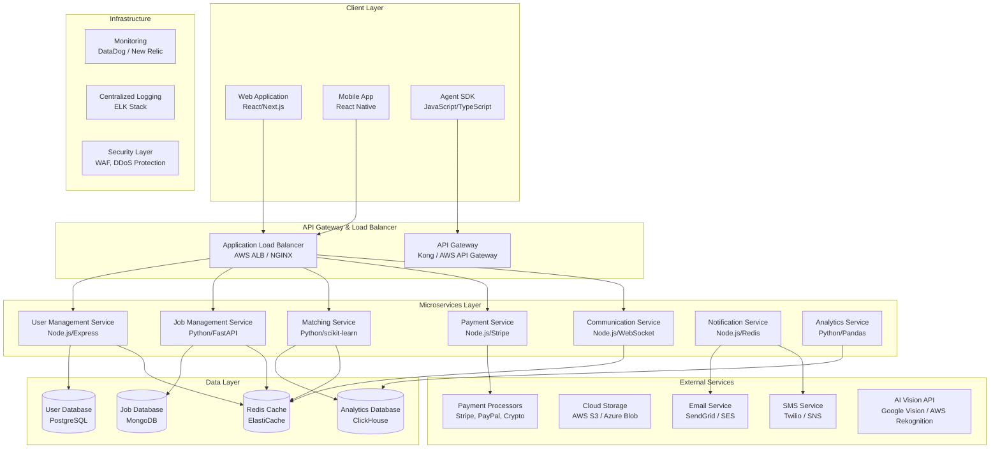
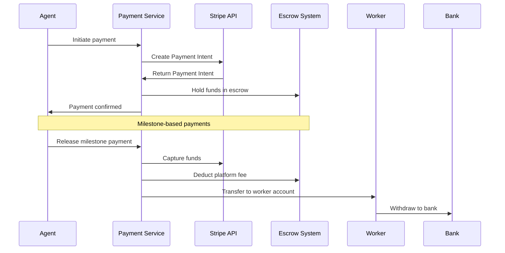
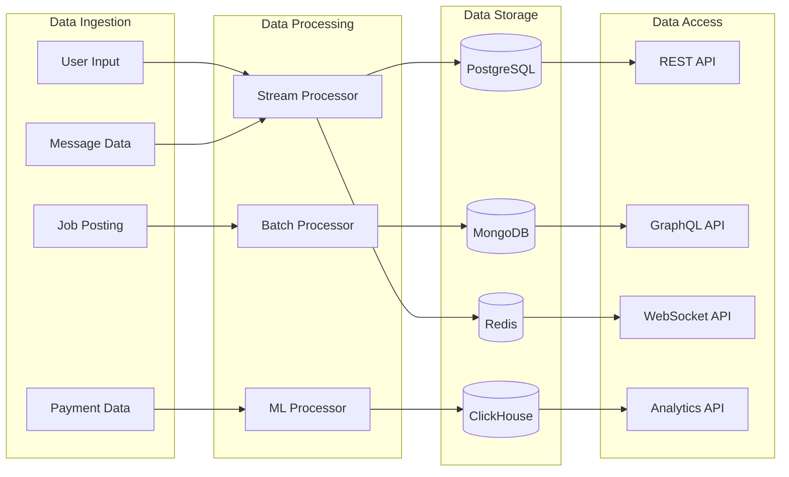
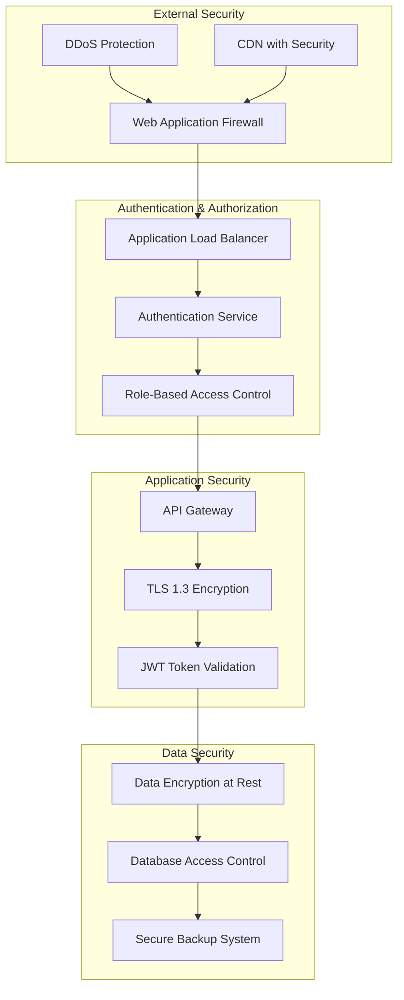

# Technical Architecture & System Design
## Rent-a-Human Application

**Document Version:** 1.0  
**Last Updated:** 2024  
**Status:** Technical Design Phase

---

## 1. System Architecture Overview

### 1.1 High-Level Architecture Diagram



---

## 2. Detailed Service Architecture

### 2.1 User Management Service

#### Core Responsibilities:
- User registration and authentication
- Profile management for both agents and humans
- Identity verification
- Permission and access control

#### Technology Stack:
- **Runtime:** Node.js 18+
- **Framework:** Express.js with TypeScript
- **Database:** PostgreSQL with Prisma ORM
- **Authentication:** JWT + OAuth 2.0
- **Caching:** Redis for session management

#### Service Endpoints:
```typescript
// Core User Operations
POST   /api/auth/register
POST   /api/auth/login
POST   /api/auth/refresh
GET    /api/users/profile/:userId
PUT    /api/users/profile/:userId
DELETE /api/users/profile/:userId

// Human Worker Operations
GET    /api/workers/skills
POST   /api/workers/skills
PUT    /api/workers/availability
GET    /api/workers/portfolio
POST   /api/workers/portfolio

// Agent Operations
GET    /api/agents/quota
POST   /api/agents/api-keys
GET    /api/agents/billing-history

// Verification
POST   /api/verification/identity
POST   /api/verification/skills
GET    /api/verification/status
```

#### Database Schema:
```sql
-- Users table (base user entity)
CREATE TABLE users (
    id UUID PRIMARY KEY DEFAULT gen_random_uuid(),
    email VARCHAR(255) UNIQUE NOT NULL,
    password_hash VARCHAR(255) NOT NULL,
    user_type ENUM('agent', 'human') NOT NULL,
    email_verified BOOLEAN DEFAULT FALSE,
    phone_verified BOOLEAN DEFAULT FALSE,
    identity_verified BOOLEAN DEFAULT FALSE,
    created_at TIMESTAMP DEFAULT CURRENT_TIMESTAMP,
    updated_at TIMESTAMP DEFAULT CURRENT_TIMESTAMP,
    last_login_at TIMESTAMP
);

-- Human worker specific data
CREATE TABLE human_profiles (
    user_id UUID PRIMARY KEY REFERENCES users(id),
    display_name VARCHAR(255) NOT NULL,
    bio TEXT,
    profile_image_url VARCHAR(500),
    hourly_rate_min DECIMAL(10,2),
    hourly_rate_max DECIMAL(10,2),
    timezone VARCHAR(50),
    languages JSONB DEFAULT '[]',
    location JSONB,
    availability JSONB DEFAULT '{}',
    rating_average DECIMAL(3,2) DEFAULT 0,
    rating_count INTEGER DEFAULT 0,
    job_success_rate DECIMAL(5,2) DEFAULT 0,
    total_earnings DECIMAL(12,2) DEFAULT 0,
    created_at TIMESTAMP DEFAULT CURRENT_TIMESTAMP,
    updated_at TIMESTAMP DEFAULT CURRENT_TIMESTAMP
);

-- Skills and qualifications
CREATE TABLE worker_skills (
    id UUID PRIMARY KEY DEFAULT gen_random_uuid(),
    user_id UUID REFERENCES human_profiles(user_id),
    skill_name VARCHAR(255) NOT NULL,
    skill_level ENUM('beginner', 'intermediate', 'advanced', 'expert'),
    verified BOOLEAN DEFAULT FALSE,
    verified_by UUID REFERENCES users(id),
    verification_date TIMESTAMP,
    created_at TIMESTAMP DEFAULT CURRENT_TIMESTAMP
);

-- Agent specific data
CREATE TABLE agent_profiles (
    user_id UUID PRIMARY KEY REFERENCES users(id),
    agent_name VARCHAR(255) NOT NULL,
    organization VARCHAR(255),
    api_quota_monthly INTEGER DEFAULT 1000,
    api_quota_used INTEGER DEFAULT 0,
    quota_reset_date DATE,
    billing_tier ENUM('free', 'professional', 'enterprise'),
    spending_limit_monthly DECIMAL(12,2),
    spending_current_month DECIMAL(12,2) DEFAULT 0,
    created_at TIMESTAMP DEFAULT CURRENT_TIMESTAMP,
    updated_at TIMESTAMP DEFAULT CURRENT_TIMESTAMP
);
```

### 2.2 Job Management Service

#### Core Responsibilities:
- Job posting creation and management
- Job matching and search functionality
- Proposal and contract management
- Job status tracking and updates

#### Technology Stack:
- **Runtime:** Python 3.11+
- **Framework:** FastAPI with Pydantic
- **Database:** MongoDB for job documents
- **Search:** Elasticsearch for advanced job search
- **Caching:** Redis for job recommendations

#### Service Endpoints:
```python
# Job Operations
POST   /api/jobs/
GET    /api/jobs/{job_id}
PUT    /api/jobs/{job_id}
DELETE /api/jobs/{job_id}
GET    /api/jobs/search

# Job Management
POST   /api/jobs/{job_id}/proposals
GET    /api/jobs/{job_id}/proposals
POST   /api/jobs/{job_id}/assign
PUT    /api/jobs/{job_id}/status

# Job Recommendations
GET    /api/workers/recommended-jobs
GET    /api/agents/active-jobs
```

#### Job Document Schema (MongoDB):
```javascript
{
  _id: ObjectId,
  agent_id: String, // UUID
  title: String,
  description: String,
  category: String, // creative, analytical, physical, research, etc.
  subcategory: String,
  skills_required: [String],
  experience_level: String, // entry, mid, senior, expert
  budget_min: Number,
  budget_max: Number,
  budget_type: String, // fixed, hourly, milestone
  duration_estimate: Number, // hours
  deadline: ISODate,
  location_type: String, // remote, on-site, hybrid
  location_details: Object,
  status: String, // draft, active, assigned, completed, cancelled
  proposals_count: Number,
  views_count: Number,
  urgent: Boolean,
  confidential: Boolean,
  attachments: [String], // S3 URLs
  created_at: ISODate,
  updated_at: ISODate,
  
  // Elasticsearch indexing fields
  es_indexed: true,
  es_search_vector: String,
  es_tags: [String]
}
```

### 2.3 Matching Service

#### Core Responsibilities:
- AI-powered job-worker matching
- Recommendation engine
- Compatibility scoring
- Matching analytics

#### Technology Stack:
- **Runtime:** Python 3.11+
- **Framework:** scikit-learn, TensorFlow
- **Database:** PostgreSQL for model data, ClickHouse for analytics
- **Vector Database:** Pinecone or Weaviate for embeddings
- **ML Pipeline:** MLflow for experiment tracking

#### Matching Algorithm Architecture:
```python
# Pseudo-code for matching algorithm
class JobWorkerMatcher:
    def __init__(self):
        self.skill_model = SkillCompatibilityModel()
        self.preference_model = PreferenceModel()
        self.performance_model = PerformancePredictor()
        
    def calculate_compatibility_score(self, job, worker):
        # Skill compatibility (40% weight)
        skill_score = self.skill_model.predict(job, worker)
        
        # Budget alignment (20% weight)
        budget_score = self.budget_alignment(job.budget, worker.rate)
        
        # Availability alignment (15% weight)
        availability_score = self.availability_match(job.deadline, worker.availability)
        
        # Performance history (25% weight)
        performance_score = self.performance_model.predict(worker.user_id)
        
        weighted_score = (
            skill_score * 0.40 +
            budget_score * 0.20 +
            availability_score * 0.15 +
            performance_score * 0.25
        )
        
        return min(weighted_score, 1.0)  # Cap at 1.0
        
    def find_best_matches(self, job_id, limit=10):
        job = self.job_repository.get(job_id)
        candidates = self.worker_repository.get_available_workers()
        
        scored_candidates = []
        for worker in candidates:
            score = self.calculate_compatibility_score(job, worker)
            if score >= 0.6:  # Minimum threshold
                scored_candidates.append((worker, score))
        
        # Sort by score and return top matches
        scored_candidates.sort(key=lambda x: x[1], reverse=True)
        return scored_candidates[:limit]
```

### 2.4 Payment Service

#### Core Responsibilities:
- Payment processing and escrow
- Milestone and automatic payments
- Fee calculation and distribution
- Payment security and compliance

#### Technology Stack:
- **Runtime:** Node.js 18+
- **Framework:** Express.js with TypeScript
- **Payment Processors:** Stripe, PayPal, Crypto APIs
- **Database:** PostgreSQL with financial compliance
- **Compliance:** PCI DSS Level 1 certified

#### Payment Flow Architecture:


#### Payment Service Endpoints:
```typescript
// Payment Management
POST   /api/payments/create-intent
POST   /api/payments/confirm
POST   /api/payments/release-milestone
GET    /api/payments/escrow-status

// Wallet Operations
GET    /api/wallet/balance
POST   /api/wallet/withdraw
GET    /api/wallet/transaction-history

// Billing
GET    /api/billing/invoices
GET    /api/billing/agent-usage
POST   /api/billing/subscription-update
```

### 2.5 Communication Service

#### Core Responsibilities:
- Real-time messaging between agents and workers
- File sharing and media upload
- Video/audio call coordination
- Message history and search

#### Technology Stack:
- **Runtime:** Node.js 18+
- **Framework:** Socket.IO for real-time communication
- **Database:** PostgreSQL for message persistence
- **File Storage:** AWS S3 with CDN
- **Video Calls:** Twilio Video or Daily.co

#### Real-time Communication Architecture:
```typescript
// Socket.IO event structure
interface MessageEvents {
  // Client to server
  'message:send': (data: {
    conversationId: string;
    recipientId: string;
    content: string;
    attachments?: string[];
    messageType: 'text' | 'file' | 'voice' | 'video';
  }) => void;
  
  'message:typing': (data: {
    conversationId: string;
    isTyping: boolean;
  }) => void;
  
  'message:read': (data: {
    conversationId: string;
    messageIds: string[];
  }) => void;
  
  // Server to client
  'message:received': (data: {
    messageId: string;
    senderId: string;
    content: string;
    timestamp: string;
  }) => void;
  
  'message:delivered': (data: {
    messageId: string;
    deliveredAt: string;
  }) => void;
  
  'typing:update': (data: {
    conversationId: string;
    userId: string;
    isTyping: boolean;
  }) => void;
}
```

### 2.6 Notification Service

#### Core Responsibilities:
- Multi-channel notification delivery
- Notification preferences management
- Real-time push notifications
- Email and SMS campaigns

#### Technology Stack:
- **Runtime:** Node.js 18+
- **Framework:** Custom notification engine
- **Message Queue:** Redis Streams
- **Email:** SendGrid or AWS SES
- **SMS:** Twilio
- **Push Notifications:** Firebase Cloud Messaging (FCM)

#### Notification Channels:
```typescript
interface NotificationChannel {
  type: 'push' | 'email' | 'sms' | 'in-app';
  priority: 'low' | 'normal' | 'high' | 'urgent';
  templateId: string;
  data: Record<string, any>;
  userPreferences: {
    enabled: boolean;
    quietHours?: {
      start: string; // HH:MM
      end: string;   // HH:MM
      timezone: string;
    };
  };
}

// Notification Types
type NotificationType = 
  | 'job_opportunity'
  | 'message_received'
  | 'payment_received'
  | 'deadline_reminder'
  | 'dispute_update'
  | 'profile_verified'
  | 'system_maintenance';
```

---

## 3. Data Architecture

### 3.1 Database Selection Strategy

| Data Type | Database | Rationale |
|-----------|----------|-----------|
| User Data | PostgreSQL | ACID compliance, complex relationships |
| Job Documents | MongoDB | Flexible schema, document storage |
| Analytics Data | ClickHouse | OLAP queries, time-series data |
| Cache Data | Redis | High performance, pub/sub messaging |
| Vector Embeddings | Pinecone/Weaviate | Similarity search, ML features |

### 3.2 Data Flow Architecture



### 3.3 Caching Strategy

#### Cache Layers:
1. **CDN Cache:** Static assets (images, CSS, JS)
2. **Application Cache:** User sessions, frequently accessed data
3. **Database Cache:** Query results, computed recommendations
4. **Edge Cache:** Regional content distribution

#### Redis Cache Structure:
```redis
# User session cache
user:session:{sessionId} -> User profile data (TTL: 24h)

# Job search results cache
job:search:{hash} -> Search results (TTL: 5m)

# Worker recommendation cache
worker:recs:{userId} -> Recommended workers (TTL: 30m)

# Message conversation cache
conversation:{convId} -> Recent messages (TTL: 1h)

# Rate limiting cache
rate_limit:{userId}:{endpoint} -> Request count (TTL: 1m)
```

---

## 4. Security Architecture

### 4.1 Security Layers



### 4.2 Authentication Flow

```typescript
// Multi-factor authentication flow
interface AuthenticationFlow {
  step1: {
    method: 'email' | 'phone' | 'oauth';
    data: string; // email, phone, or provider token
    action: 'send_code' | 'verify_token';
  };
  
  step2: {
    method: 'totp' | 'sms' | 'email';
    data: string; // verification code
    action: 'verify_code';
  };
  
  step3: {
    result: 'success' | 'failure';
    tokens?: {
      accessToken: string;
      refreshToken: string;
      expiresIn: number;
    };
  };
}

// JWT Token Structure
interface JWTToken {
  header: {
    alg: 'HS256';
    typ: 'JWT';
  };
  payload: {
    sub: string; // user id
    email: string;
    userType: 'agent' | 'human';
    permissions: string[];
    iat: number;
    exp: number;
  };
  signature: string;
}
```

### 4.3 Data Encryption

#### Encryption at Rest:
- **Database:** AES-256 encryption for sensitive data
- **File Storage:** Server-side encryption with customer-managed keys
- **Backup Storage:** Encrypted backups with key rotation

#### Encryption in Transit:
- **API Calls:** TLS 1.3 for all communications
- **WebSocket:** WSS (WebSocket Secure) for real-time data
- **File Transfer:** Encrypted upload/download endpoints

#### Key Management:
```typescript
// Key rotation and management
interface KeyManagement {
  encryptionKeys: {
    algorithm: 'AES-256-GCM';
    rotationInterval: '90 days';
    keyDerivation: 'PBKDF2';
    storage: 'AWS KMS' | 'Azure Key Vault';
  };
  
  databaseEncryption: {
    transparentDataEncryption: true;
    columnLevelEncryption: [
      'users.password_hash',
      'payments.card_data',
      'messages.attachments'
    ];
  };
}
```

---

## 5. Scalability & Performance

### 5.1 Horizontal Scaling Strategy

#### Service-Level Scaling:
```yaml
# Kubernetes HPA configuration
apiVersion: autoscaling/v2
kind: HorizontalPodAutoscaler
metadata:
  name: user-service-hpa
spec:
  scaleTargetRef:
    apiVersion: apps/v1
    kind: Deployment
    name: user-service
  minReplicas: 3
  maxReplicas: 50
  metrics:
  - type: Resource
    resource:
      name: cpu
      target:
        type: Utilization
        averageUtilization: 70
  - type: Resource
    resource:
      name: memory
      target:
        type: Utilization
        averageUtilization: 80
```

#### Database Scaling:
- **Read Replicas:** PostgreSQL read replicas for query distribution
- **Sharding:** User-based sharding for large datasets
- **Connection Pooling:** PgBouncer for connection management

### 5.2 Performance Optimization

#### Caching Strategy:
```typescript
// Multi-level caching implementation
class CacheManager {
  private l1Cache: Map<string, any> = new Map(); // In-memory
  private l2Cache: Redis; // Redis cache
  private l3Cache: CDN; // CDN for static content
  
  async get<T>(key: string): Promise<T | null> {
    // L1 Cache check
    if (this.l1Cache.has(key)) {
      return this.l1Cache.get(key);
    }
    
    // L2 Cache check
    const l2Result = await this.l2Cache.get(key);
    if (l2Result) {
      this.l1Cache.set(key, l2Result);
      return JSON.parse(l2Result);
    }
    
    return null;
  }
  
  async set<T>(key: string, value: T, ttl: number = 3600): Promise<void> {
    this.l1Cache.set(key, value);
    await this.l2Cache.setex(key, ttl, JSON.stringify(value));
  }
}
```

#### Database Query Optimization:
```sql
-- Indexed columns for frequent queries
CREATE INDEX CONCURRENTLY idx_jobs_status_category ON jobs(status, category);
CREATE INDEX CONCURRENTLY idx_workers_skills ON worker_skills(user_id, skill_name);
CREATE INDEX CONCURRENTLY idx_proposals_job_status ON proposals(job_id, status);

-- Partial indexes for filtered queries
CREATE INDEX CONCURRENTLY idx_active_jobs ON jobs(id) 
WHERE status = 'active';

-- Composite indexes for complex queries
CREATE INDEX CONCURRENTLY idx_worker_location_rate ON human_profiles(location, hourly_rate_min)
WHERE rating_average >= 4.0;
```

### 5.3 Load Testing Strategy

#### Performance Benchmarks:
- **API Response Time:** < 200ms for 95th percentile
- **Database Queries:** < 50ms for standard queries
- **File Uploads:** < 5 seconds for 10MB files
- **Real-time Messaging:** < 100ms latency

#### Load Testing Scenarios:
```javascript
// Artillery.io load testing configuration
module.exports = {
  config: {
    target: 'https://api.rent-a-human.com',
    phases: [
      { duration: 60, arrivalRate: 10 },    // Warm up
      { duration: 300, arrivalRate: 50 },   // Normal load
      { duration: 120, arrivalRate: 100 },  // Peak load
      { duration: 60, arrivalRate: 10 }     // Cool down
    ]
  },
  scenarios: [
    {
      name: 'User Registration Flow',
      weight: 20,
      flow: [
        { post: { url: '/api/auth/register', json: userData }},
        { post: { url: '/api/auth/login', json: loginData }},
        { get: { url: '/api/users/profile' }}
      ]
    },
    {
      name: 'Job Posting Flow',
      weight: 30,
      flow: [
        { post: { url: '/api/jobs', json: jobData }},
        { get: { url: '/api/jobs/{{jobId}}' }},
        { put: { url: '/api/jobs/{{jobId}}/status', json: { status: 'active' }}}
      ]
    }
  ]
};
```

---

## 6. Monitoring & Observability

### 6.1 Monitoring Stack

#### Infrastructure Monitoring:
- **Metrics:** Prometheus + Grafana
- **Logs:** ELK Stack (Elasticsearch, Logstash, Kibana)
- **Traces:** Jaeger or AWS X-Ray
- **APM:** New Relic or DataDog

#### Custom Metrics:
```typescript
// Application-specific metrics
interface ApplicationMetrics {
  business: {
    activeUsers: number;
    jobsPosted: number;
    jobsCompleted: number;
    revenue: number;
    conversionRate: number;
  };
  
  technical: {
    responseTime: number;
    errorRate: number;
    databaseConnections: number;
    memoryUsage: number;
    cpuUsage: number;
  };
  
  userExperience: {
    pageLoadTime: number;
    apiLatency: number;
    userSatisfaction: number;
    taskSuccessRate: number;
  };
}
```

### 6.2 Alerting Strategy

#### Critical Alerts:
- Service downtime > 30 seconds
- Error rate > 5% for 5 minutes
- Database connection failures
- Payment processing failures
- Security breach detection

#### Warning Alerts:
- Response time > 500ms for 2 minutes
- CPU usage > 80% for 5 minutes
- Disk space > 85%
- High memory usage

### 6.3 Logging Architecture

#### Structured Logging:
```typescript
// JSON-structured logging
interface LogEntry {
  timestamp: string;
  level: 'DEBUG' | 'INFO' | 'WARN' | 'ERROR';
  service: string;
  traceId: string;
  spanId: string;
  userId?: string;
  action: string;
  details: Record<string, any>;
  duration?: number;
  statusCode?: number;
}

// Example log entries
{
  "timestamp": "2024-01-15T10:30:00.000Z",
  "level": "INFO",
  "service": "user-service",
  "traceId": "abc123-def456-ghi789",
  "spanId": "span001",
  "userId": "user-123",
  "action": "user_login",
  "details": {
    "method": "email",
    "success": true,
    "ipAddress": "192.168.1.1"
  },
  "duration": 150
}
```

---

## 7. Deployment Architecture

### 7.1 Container Strategy

#### Docker Configuration:
```dockerfile
# Multi-stage build for Node.js service
FROM node:18-alpine AS builder
WORKDIR /app
COPY package*.json ./
RUN npm ci --only=production

FROM node:18-alpine AS runtime
WORKDIR /app
COPY --from=builder /app/node_modules ./node_modules
COPY . .
EXPOSE 3000
CMD ["npm", "start"]
```

#### Kubernetes Deployment:
```yaml
apiVersion: apps/v1
kind: Deployment
metadata:
  name: user-service
  labels:
    app: user-service
spec:
  replicas: 3
  selector:
    matchLabels:
      app: user-service
  template:
    metadata:
      labels:
        app: user-service
    spec:
      containers:
      - name: user-service
        image: rent-a-human/user-service:v1.0.0
        ports:
        - containerPort: 3000
        env:
        - name: DATABASE_URL
          valueFrom:
            secretKeyRef:
              name: database-secret
              key: url
        - name: REDIS_URL
          value: "redis://redis-service:6379"
        resources:
          requests:
            memory: "256Mi"
            cpu: "250m"
          limits:
            memory: "512Mi"
            cpu: "500m"
        livenessProbe:
          httpGet:
            path: /health
            port: 3000
          initialDelaySeconds: 30
          periodSeconds: 10
        readinessProbe:
          httpGet:
            path: /ready
            port: 3000
          initialDelaySeconds: 5
          periodSeconds: 5
```

### 7.2 CI/CD Pipeline

#### GitHub Actions Workflow:
```yaml
name: Deploy to Production
on:
  push:
    branches: [main]

jobs:
  test:
    runs-on: ubuntu-latest
    steps:
    - uses: actions/checkout@v3
    - uses: actions/setup-node@v3
      with:
        node-version: '18'
    - run: npm ci
    - run: npm test
    - run: npm run lint
    - run: npm run security-audit

  build:
    needs: test
    runs-on: ubuntu-latest
    steps:
    - uses: actions/checkout@v3
    - name: Build Docker image
      run: |
        docker build -t rent-a-human/user-service:${{ github.sha }} .
        docker tag rent-a-human/user-service:${{ github.sha }} rent-a-human/user-service:latest

  deploy:
    needs: build
    runs-on: ubuntu-latest
    if: github.ref == 'refs/heads/main'
    steps:
    - name: Deploy to Kubernetes
      run: |
        kubectl set image deployment/user-service user-service=rent-a-human/user-service:${{ github.sha }}
        kubectl rollout status deployment/user-service
```

---

## 8. Disaster Recovery & Business Continuity

### 8.1 Backup Strategy

#### Database Backups:
- **Automated Daily Backups:** PostgreSQL with 30-day retention
- **Point-in-Time Recovery:** Continuous WAL archiving
- **Cross-Region Replication:** Backup storage in multiple regions
- **Backup Testing:** Monthly restore testing

#### Application Backups:
- **Code Repository:** Git with multiple remote repositories
- **Configuration Management:** Infrastructure as Code (Terraform)
- **Secrets Management:** Encrypted secret storage with rotation

### 8.2 Disaster Recovery Plan

#### Recovery Time Objectives (RTO):
- **Critical Services:** < 15 minutes
- **Standard Services:** < 1 hour
- **Non-Critical Services:** < 4 hours

#### Recovery Point Objectives (RPO):
- **Payment Data:** < 1 minute (near-zero data loss)
- **User Data:** < 15 minutes
- **Analytics Data:** < 1 hour

#### Failover Strategy:
```yaml
# Kubernetes cluster configuration for multi-region deployment
apiVersion: v1
kind: ConfigMap
metadata:
  name: cluster-config
data:
  regions: |
    primary: us-east-1
    secondary: us-west-2
    tertiary: eu-west-1
  
  failover_plan: |
    1. Automatic failover triggers on service health failure
    2. DNS updates to point to secondary region
    3. Database read replicas promoted to primary
    4. Cache warming and session recovery
    5. Health check validation before declaring success
```

---

This technical architecture document provides a comprehensive foundation for implementing the Rent-a-Human application with scalable, secure, and maintainable infrastructure. The design prioritizes performance, reliability, and security while maintaining flexibility for future enhancements and scaling requirements.